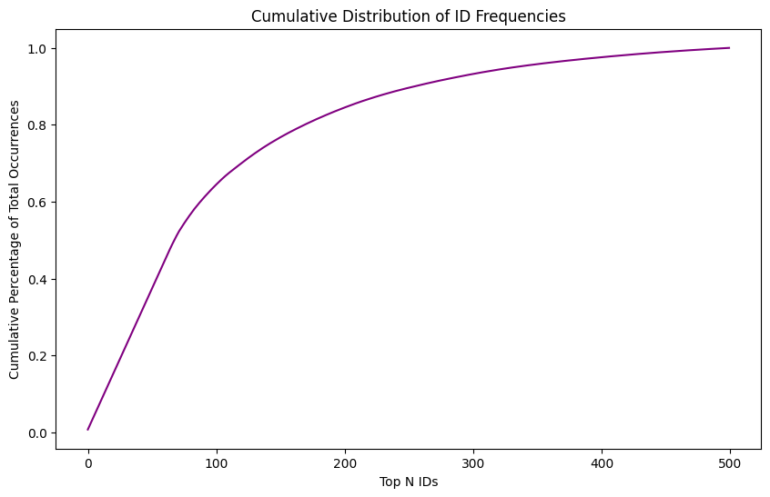
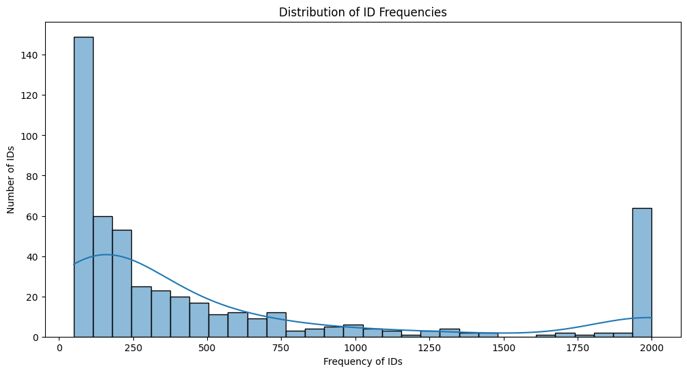
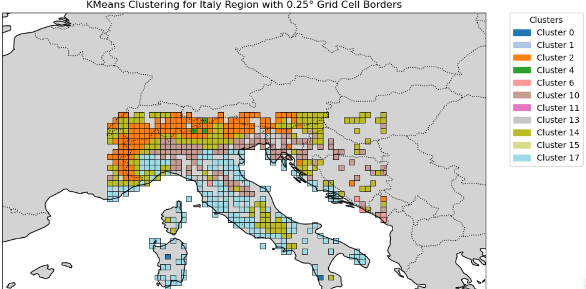
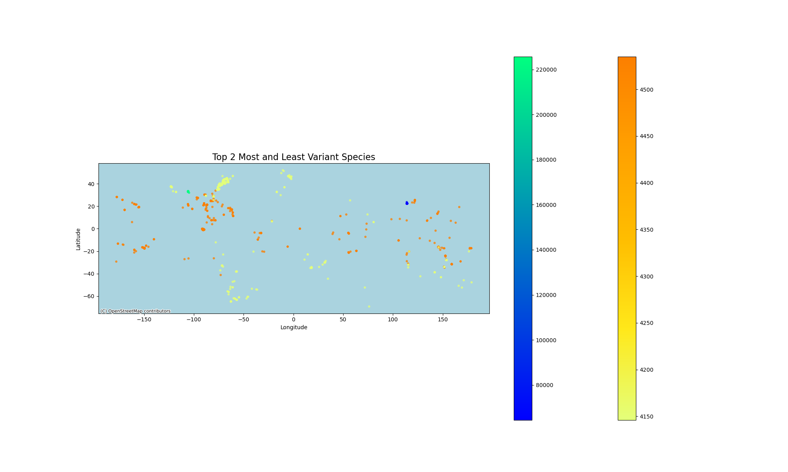

# aml_assignment

# 30-10-2024
Performed some simple analysis on the distribution of the species data



Around 100 species account for approx. 60% of provided data



We have a long tail of species with fewer than 500 entries, compared to the maximum recorded entries of 2000 per species.

# 26-10-2024

In order to overcome the problem of incomplete data, we decided to take matters into our own hands and scrape the data from the EOL website, without a thought for ethical and legal considerations. The justification for this is that this data is available freely on the web, such usage is in line with their terms (see: https://api.eol.org/docs/what-is-eol/terms-of-use), and that we need this information for a relatively small scale (only 500 species).

We were able to obtain traits for almost all of the species IDs, for traits that describe it further like 'locomotion', 'mass', and traits that can relate it to other species like 'preyed upon', 'are eaten by' etc.

The corresponding code and information can be foundin /scraping

# 25-10-2024

Investigating the completeness of traits available in traits.csv. 
This file was downloaded from here: https://opendata.eol.org/dataset/all-trait-data-large/resource/6e24f0df-56ee-470f-b81e-e5a367a65bfb

We noticed a discrepancy between the information presented in the website, and that found in the downloaded csv. 
As a case study, we picked an animal "Pseudaspis cana" and checked the information on the website here: https://api.eol.org/pages/962419
this shows traits like "Body symmetry", "are eaten by" etc. 

In order to check if this information is available locally, we first try to find all traits for this animal. We did this by

```
DFtraits[DFtraits['scientific_name'] == "Pseudaspis cana"]
```

In order to find out if the trait is present, we first checked if there's a mapping from trait name to trait_id or some other representation, like so:

``` 
$ grep -E 'are eaten by' Data/traits/terms.csv
http://purl.obolibrary.org/obo/RO_0002471,are eaten by,association
```

Next, we filtered by checking for the presence of these traits as string values. 

```
# DFtraits[DFtraits['page_id'] == 962419].apply(lambda row: row.astype(str).str.contains('RO_0002471').any(), axis=1)
```

The above search yield false for all values, indicating that no such trait was present.
We repeated this for another animal 'Serpentes' and did find the presense of one trait (which validated the methodology), but confirmed the hypothesis that the data is incomplete for many animals.

## Annie 6/11

Added the code 'locations_definition' to define new clusters with 0.25 degree boxes. The boxes were only made for locations we had in the map. These were then clustered in 20 new clusters based on bioclimatic. Can access all of this in the Data\species\df_final. The value indicates the bottom left corner of the grid cell. As an example if if lat_grid = -76 and lon_grid = -103 then the grid cell will be from -76 to -75.75 latitude and -103 to -102.75 longitude. After that a unique label is generated : combination of cluster + number of box. The number of boxes are numbered row-wise e.g. box 1 is on the left of box 2 - this can help when assesing the algorithms ( if they are vertically close it depends btw - it is not always just +x amount since we only made boxes on locations present in our dataset). This unique label should be used now.
The clusters were tested statistically and they are statistically different based on bioblimatic variables using the Kruskal-Wallis H test ( thanks chatgpt)

This is an example of what it looks like. We can see for example for Italy, all the poitns in te alpes are actually color coded with orange and differ from the surrounded areas. (great for the report)



## Ram 7/11
Made an adjustmnet to how we calculate variance of a given species. Lat/Longs are points mapped onto a higher dimension manifold (aka the globe), and hence you may get inaccurate values taking averages on the lower manifold (aka assuming they are points on a 2D plane). To fix this, we can first map the (lat,long) to cartesian point (x,y,z), and calculate mean based on those values to figure out what the centroid is. Once we have a centroid, we can map it back to (lat, long), and for each (lat, long), measure the haversine distances and calculate the variance based on this function. 

Displayed the top 2 most and least variant species here. The visualization can be better.


Relevant paper: https://doi.org/10.1016/j.ecolmodel.2005.03.026
This paper talks about the following points that we would find useful:
1. Pitfalls of having presence only data
A number of other serious potential pitfalls may affect the accuracy of presence-only modeling; some of these also apply to presence–absence modeling. First, occurrence localities may be biased. For example, they are often highly correlated with the nearby presence of roads, rivers or other access conduits (Reddy and D´avalos, 2003). The location of occurrence localities may also exhibit spatial auto-correlation (e.g., if a researcher collects specimens from several nearby localities in a restricted area). Similarly, sampling intensity and sampling methods often vary widely across the study area (Anderson, 2003). In addition, errors may exist in the occurrence localities, be it due to transcription errors, lack of sufficient geographic detail (especially in older records), or species misidentification.

2. They model each species' habitat as a 'niche' (similar to our notion), and talk about 'realized' niche and 'fundamental' niche (the first is purely based on our data, and latter is ideally what the species would like in the world). Having positive only data + human factors means that we can only aim to learn the realized niche as an approx. of the fundamental niche for a species. 

3. it compares presence-only modeling methods, and provides us a framework of comparing results. 

Another paper: https://nsojournals.onlinelibrary.wiley.com/doi/epdf/10.1111/j.1600-0587.2013.00321.x
"Although many interesting aspects of the species' distribution can be learned from such data, one cannot learn the overall species occurence probability"
Rebutts the idea of drawing conclusions about the overall species occurence probability from presence-only data. We could cite this when talking about how we are planning to estimate similar habitats?
