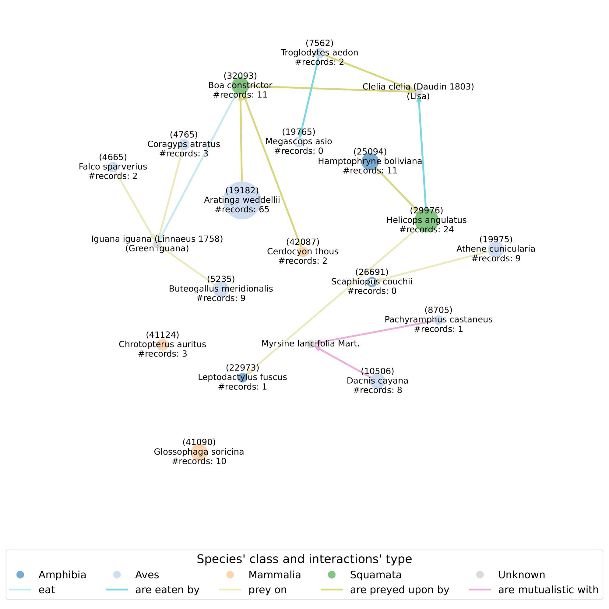

# Applied Machine Learning Assignment

## Abstract

This project aims to map and study global biodiversity, exploring key questions such as where particular species are located, what is their variety across different geographic areas, and how they interact with environmental factors and other species. Additional data (i.e., bioclimatic and biological features) in combination with various ML techniques (e.g., K-means, Random Forest, K-Nearest Neighbors, LightGBM, XGBoost) and network analysis methods are leveraged to address these pattern recognition tasks, as the initial dataset — composed of online platforms' user-logged sighting records — is both noisy and low-dimensional compared to the underlying problem's complexity.

## Analysis

To produce the insights discussed in the [report](./Project_report.pdf), a series of analyses have been operated which can be found in the relevant [notebook](./Project_analysis.ipynb). These procedures can be run from scratch based on the inputs extracted and cleaned in the [*Data* directory](./Data), or toggling the reproduction of the results stored in the [*Outputs* directory](./Outputs) through the code-behavior Boolean variables at the beginning of the notebook. The packages used are listed in [requirements.txt](./requirements.txt), and an equivalent file is present in the relevant folder for each data preparation process too.

> [!WARNING]  
> Some input and output data needed to run specific parts of the code are missing from the appropriate folder, since they are too heavy to be pushed on GitHub: please download them locally [here](https://drive.google.com/drive/folders/1Ojkg_U0m5Kp5ZZtRLn5YiAnA9nsLqpN_?usp=sharing).

## Conclusions

We examined biodiversity mapping based on species' occurrence data as recorded by sightseeing platforms; our main task was to develop models to predict a set of possible species given a location on the globe, and to define the areas occupied by each species. After an exploratory analysis of the geographic distribution information, we represented the documented presence of species through KDE, visualizing the probability distribution for the various species to be observed worldwide. This technique was used to identify patterns of species’ co-occurrence, and prompted Decision-Tree-based clustering by frequented areas. Early results highlighted the need for further information in order to reach a satisfactory level of species’ mapping accuracy.

To better understand biodiversity patterns, we incorporated environmental data, dividing the worldwide coordinates into regions based on bioclimatic characteristics; grid cells were first clustered using K-means, then grouped into geographically cohesive habitats with DBSCAN. K-Nearest Neighbors and Random Forest models were fine-tuned to predict species presence, showing significant performance improvements when bioclimatic features were included. For the more complex task of assigning species to geographic areas, LightGBM and XGBoost models were trained on six selected regions, leveraging the incorporated sparse species' traits data. As discussed above, the demonstrably broad species distribution made this task inherently challenging. However, it was shown that building region-specific models proved beneficial for enhancing predictions. 

Our findings highlight the uneven distribution of biodiversity data, shaped by species' natural occurrences and their likelihood of being recorded by platform users. While ordinary methods achieved moderate success in predicting the most observed species near a location, plain species-to-location models showed low accuracy when not evaluated in specific regions. This aligns with the observation that animals are not strictly tied to narrow areas but are instead associated with favorable environmental conditions and co-occurring species. Predicting a species' exact location reduces biodiversity mapping to estimating where sightings were recorded, which is insufficient for understanding species' distribution. A more effective approach involves embedding their biological traits and comparing them to habitats, testing the fit of environmental and ecological factors.

Finally, considering the complex systems that the original dataset qualitatively represents, we delved into an ecosystem-oriented study, leveraging the obtained location- and environment-based habitats determination together with the interaction properties of each species, to address shortages and enhance a causal understanding of our other results. This network-based ecological analysis provided an additional layer of insight, linking species’ co-occurrences to biological relations and suggesting potential methods to obtain better ecological knowledge, to be used as citizen science platforms’ strategies to gamify collection efforts targeted at verifying predictions and filling information gaps.

### Ecosystem summative graph-representation example

